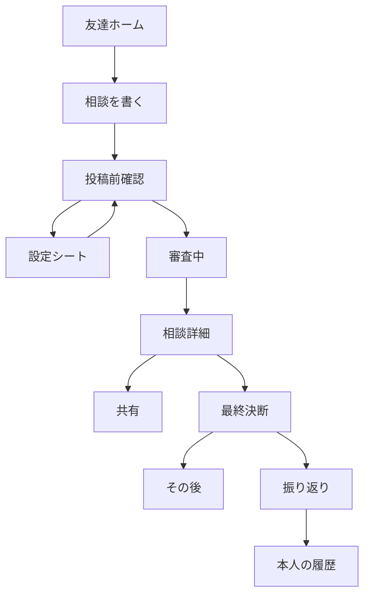
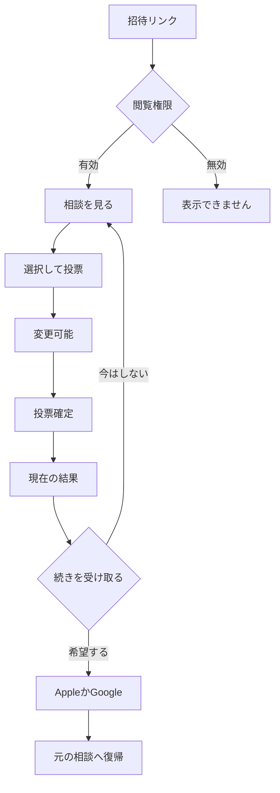
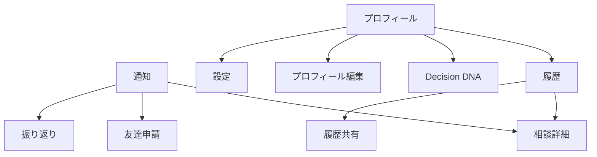

# 02 画面遷移

画面IDは03・画面カタログ・受入条件で共通。`+` はモーダルスタックを開くアクション。ホームのタブ、スクロール位置、ページカーソルは詳細から戻っても保持する。

## 相談する人

確認画面は毎回通るが、設定シートは開かなくてよい。審査中は作者だけに表示。審査完了後の定型期限は公開時刻から数える。投稿完了と審査完了を同じ文言で扱わない。

## 参加する人

既に登録済みなら再登録せず既存アカウントで継続。OAuthをキャンセルしてもゲスト票は残る。リンクは `/i/{opaqueToken}`、公開は `/d/{postId}`、ユーザーQRは `/u/{handle}?action=friend-request`。UUIDだけで招待権限を代替しない。

## 継続と自己表現

通知は現在の権限で対象を再取得。削除・非表示・失効したものは共通の表示不可画面へ。招待経由で登録してもFriend/Followを自動追加しない。未回答Decisionは通知センターの「お知らせ」に置き、対応Badgeに加えない。

## 戻る・直リンク・認証

| 条件 | 決める挙動 |
|---|---|
| 作成1→作成2→戻る | 入力・画像・設定を保持 |
| 作成中に閉じる | 下書きを保存して閉じる。明示的な「下書きを削除」だけ確認 |
| 写真・日時シートをキャンセル | シート前の確定値へ戻す |
| 登録が必要な操作 | 目的と復帰先を保持し認証へ。許可された内部ルートだけを復元 |
| OAuth復帰 | サーバー発行のflowIdからpostIdを復元。外部URLのreturnToを直接信用しない |
| 直リンクで詳細を開く | 戻る先がなければホーム。Webゲストは登録を要求せず相談へ |
| 投票送信結果不明 | 同じidempotencyKeyで照会/再送。選択を新しい票として送り直さない |
| 期限到達 | サーバーの状態を再取得。ローカル時計だけで終了・延長を確定しない |
| Push許可を拒否 | 元の操作を継続。アプリ内通知だけを使う |

画面数を増やさないため、投票変更、ひとこと、回答者、期限指定、相談相手、カテゴリ、通報はシートで扱う。最終決断・振り返りは集中して操作する専用画面。Webは受信・認証・自分の参加の続きが中心で、R1でモバイル全機能をWebへ複製しない。
