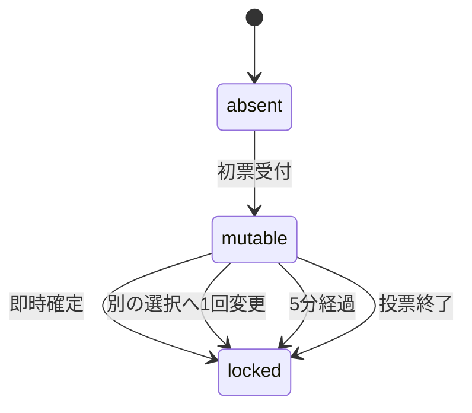

# 05 状態と時間

## 独立した状態軸

| 軸 | 状態 |
|---|---|
| publication | checking / visible / held / rejected / deleted |
| poll | open / closed、closeReason=deadline/manual/no_answers |
| ballot | absent / mutable / locked、validity=valid/invalid/merged |
| final | pending / deferred / recorded、recordedの値=A/B/neither |
| review | not_due / due / postponed / dismissed / answered |
| historyShare | self / friends / public、enabled=true/false |

publicationとpollを混ぜない。非表示中に締切が来ても裏側で終了するが、他者へ結果を配信しない。deletedは利用者向けの終端。復活は通常APIに用意しない。

## 時間の正本

入力日時はISO8601とIANA timezone、DBはtimestamptz。日時指定の曖昧な夏時間は端末の明示offsetを要求し、存在しない現地時刻はエラー。定型投票時間は絶対経過時間（1d=24h、1w=168h）。本人期限の「翌日」は保存したtimezoneでの暦日。

境界は `now < endsAt` のときだけ投票可、`now < firstAcceptedAt+300秒` のときだけ変更可。等しい時刻は締切済み。トランザクションが投稿ロックを取得した直後に `clock_timestamp()` を一度採り、その操作の判定時刻とする。ネットワーク送信開始時刻や長いトランザクションの開始時刻を使わない。

## 原子的操作

全操作の順序：検証済みprincipal→idempotency照合→投稿ロック→deadlineのsettle→現在の認可→expectedRevision→状態検証→変更→安全な応答/通知outbox→commit。ID再送は同じpayloadHashなら同じ論理結果、異なるpayloadは409。再送でも現在の閲覧権限を再確認し、失効後に古い機密レスポンスを再返却しない。

| 操作 | 原子的に行うこと |
|---|---|
| 初票 | actor+postの一意性、自票拒否、受付中、invite有効、validity。firstVoteEverAtを一度だけ設定 |
| 編集 | poll=openかつfirstVoteEverAtがnullの時のみ本文更新。終了後は0票でも本文を凍結。revision++。AI判定は新しい版を対象 |
| 変更 | 元のballotをロック。mutable、5分以内、変更0回、違うchoiceならchangeCount=1とlockedAtを同時保存 |
| 確定 | 既にlockedなら同じ状態。mutableならlockedAtを保存 |
| 手動終了 | 延長を行わずclosedへ、全mutableを締切時点でlockedへ、finalDueAtを再計算 |
| 自然終了 | 有効受付票0・延長未使用・定型対象なら旧endsAt+延長。期限をもう過ぎていれば同じ操作内で終了 |
| 最終決断 | poll=closed、authorのみ、最新版revisionを更新。旧Review通知を取消、新Review時計、初回決断通知 |
| 保留 | final行は作らずdeferredUntil=now+24h。Review/決断通知を作らない |
| Review | 最新finalRevisionを確認、score保存、未送信催促取消、統計再計算予約 |
| 範囲縮小/削除 | policyRevision++、grant失効、共有用記録無効、outbox取消、画像取得拒否 |

Cronが遅れても、投票API/詳細API/フィード整形でsettleする。期限を過ぎたopen行を表示して新規票を受け付けない。0票延長は旧期限を基準にするので、遅いCron実行時刻から再び3時間を与えない。

延長前に到着した受付票が、同じ投稿ロックで延長判定より先にcommitしたなら0票ではない。ロック順の逆なら延長後の期限でその票を判定する。先に終了がcommitしたなら後の票を拒否する。

## ゲスト統合

別アカウントへ統合するときは対象actorをUUID順、投稿をUUID順、ballotの順にロックしデッドロックを避ける。既存登録アカウントの票を優先し、重複ゲスト票をmergedにする。既存票がなければゲスト票の時刻・変更回数・確定状態・元の匿名表示を維持して移管する。

登録アカウントがその相談の作者だった場合、自己投票にあたるゲスト票をinvalidにする。公開後の総数が変われば集計版を更新し、「重複などを除外して集計を更新」と表示可能にする。締切は再開せず、過去の本人決断を変更しない。

## 決断訂正とReview

訂正は新しいfinalRevision。以前のReviewはその版の記録として本人だけが見られる。現在のスコア/DNAには最新版だけを使う。新しい決断時刻+72h/+144hで催促を作り直す。以前に振り返り辞退をしていても新しい選択は別の版なので、新しい時計に従う。訂正の通知はアプリ内の既存項目更新だけで、毎回Pushを出さない。

Review自体の点数・メモ編集はreviewRevisionを増やし、決断の版は変えない。公開済み記録にその項目が含まれるなら共有をselfへ戻す。自分のデータ訂正・削除でDNAの最低件数を割れば即分析中へ戻す。

## 数値例

2026-09-09 12:00 JST公開、3h、本人期限翌日なら投票15:00、本人期限9月10日23:59:59。15:00に0票なら18:00へ1回延長、本人期限は同じ。23時から日付を跨ぐ延長なら本人期限も実際の終了日基準で再計算する。

この例の15:00ちょうどの操作は、延長のsettle後に新しい終了時刻で判定する。1票でもあれば15:00に終了し、その時刻の新規票は拒否する。手動終了は0票でも延長しない。
