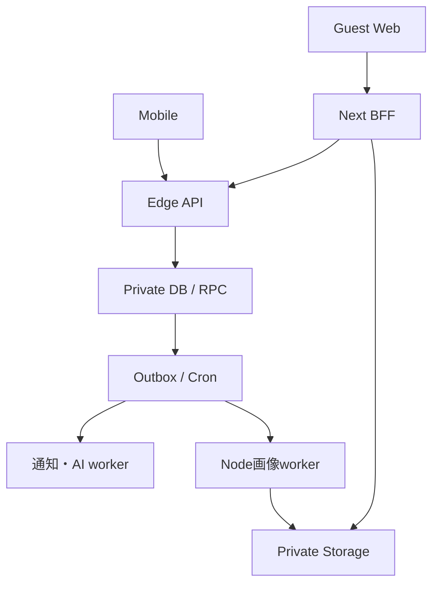

# 06 技術構成

モバイルはReact Native / Expo / Expo Router / TypeScript。Webはゲスト投票・認証復帰・共有・運営に絞ったNext.js App Router。Supabase Auth、PostgreSQL、private Storage、Edge Functions、Cronを使う。React Nativeの全画面をWebへ移植する構成にはしない。

確認時のExpo互換表はSDK57、React Native0.86、React19.2.3、最低Node22.13。開発基準はNode24。着手時に安定版タグと互換性を再確認し、正確なpatchとpackage managerをlockfileへ固定する。Next.jsとExpoが必要とするReactの版は各アプリ内で解決し、React依存のないdomain/contractsだけを共有する。

| ディレクトリ | 責務 |
|---|---|
| apps/mobile | Expo routes、画面、SecureStore、端末通知、画像選択 |
| apps/web | Next.jsゲスト/共有/運営、HttpOnly session、OAuth BFF、画像proxy |
| packages/domain | 時刻・投票・DNA等の純粋関数、server/clientで同じ入力正規化 |
| packages/contracts | OpenAPI由来の型とruntime validation。DB行の型をそのまま公開しない |
| packages/design | tokensと表示用定数。業務権限を含めない |
| supabase/migrations | テーブル・制約・RPC・権限・private bucket policy |
| supabase/functions | verified JWT→業務RPC、軽量worker、AI呼び出し |
| tests | domain、DB競合、API投影、Web、実機フロー |

全業務操作はAPI adapter→verified principal→transaction RPC。service_roleはサーバー限定であり、RPC内でactorの停止状態、現在のACL、操作権限を必ず検査する。一般JWTが直接private schemaへ到達できる設計にしない。新しい公開RPCはEXECUTEをPUBLICから剥奪し、service roleに限る。

Webはserver管理のopaque HttpOnly/Secure/SameSite=Lax cookie。Authのaccess/refresh tokenは暗号化したserver sessionに保存し、localStorageへ置かない。NativeはSecureStore。OAuth state/PKCE、戻り先の許可リスト、CSRF token＋Origin検証を実装。userIdをrequest bodyから信用しない。公開閲覧にはアカウント作成不要、ゲスト投票時にのみanonymous Authを作る。

EdgeのJWT検証は署名/issuer/audience/expを確認し、Auth userとactorを対応。anonymous Authもauthenticated DB roleを使うため、そのrole名だけで登録者と判断しない。登録未完了・停止・削除中をDB側でも拒否する。

画像decode/EXIF除去/縮小はNode runtimeのworkerでSharpを使う。Supabase EdgeのCPU/メモリーとnative画像ライブラリ制約を避けるため。cronはHMAC認証したworker起動口を呼び、workerはDBからleaseしたasset IDだけを処理する。任意URLをfetchするAPIにしない。1画像ごとに入力サイズ・画素数・時間を制限し、同期投票経路に画像やAI処理を入れない。

R1はfocus時再取得＋表示中15秒polling、背景では停止。RealtimeはM4以降の任意最適化で、対象IDとrevisionだけを本人向けchannelへ送る。生ballot/author_idをbroadcastしない。role別応答はCache-Control: private, no-store。読取失敗を0票として描画しない。

この一式は設計と実行可能な参照コード。稼働するアプリ、業務RPC、OAuth接続が既に完成しているという意味ではない。
